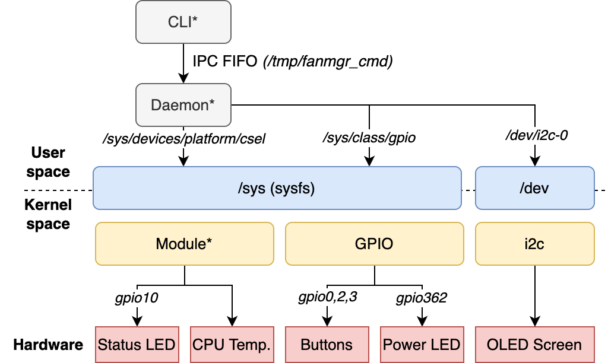

# CSEL - Mini Project

## Overview

The goal of this mini project is to implement an application that can read CPU temperature and control its fan speed.
Since there is no fan on the NanoPi NeoPlus2, the LED will simulate the fan speed: the higher the fan speed, the higher the LED blink frequency.

The project consists of three main components:
- **Kernel Module** (`csel.ko`): Provides sysfs interface for temperature monitoring and fan control
- **Daemon** (`fanmgr`): User-space daemon that monitors GPIO buttons and manages OLED display
- **CLI Tool** (`fanctl`): Command-line interface for controlling the fan manager daemon

## Architecture



> The architecture diagram illustrates the interaction between the kernel module, daemon, CLI tool, and hardware components.
> Elements marked with an asterisk (*) indicate components that are developed as part of this project.

## Components

### Kernel Module (`module/`)
- Implements sysfs interface for temperature and fan control
- Provides automatic temperature-based fan speed control
- Supports manual fan speed override
- Controls LED blinking to simulate fan speed

### Daemon (`daemon/`)
- Monitors hardware buttons (K1, K2, K3) for user input
- Displays system status on OLED screen
- Accepts commands via FIFO from CLI tool
- Manages power LED and system state

### CLI Tool (`cli/`)
- Command-line interface for remote daemon control
- Communicates with daemon via FIFO (`/tmp/fanmgr_cmd`)
- Supports frequency and mode control commands

### Init Script (`S60fanmgr`)
- System V init script for automatic daemon startup
- Handles module loading and daemon lifecycle
- Provides start/stop/restart/status operations

## Building

Build all components:
```bash
make
```

Build individual components:
```bash
make module    # Build kernel module
make daemon    # Build daemon
make cli       # Build CLI tool
```

Clean build artifacts:
```bash
make clean
```

## Installation

Install all components to system:
```bash
make install
```

This will:
- Install kernel module to `/lib/modules/$(uname -r)/extra/`
- Install daemon binary to `/usr/bin/fanmgr`
- Install CLI tool to `/usr/bin/fanctl`
- Install init script to `/etc/init.d/S60fanmgr`

## Usage

### Starting the System

Load the kernel module and start the daemon:
```bash
# Manual start
modprobe csel
fanmgr

# Or use init script
/etc/init.d/S60fanmgr start
```

### Using the CLI Tool

Control fan frequency:
```bash
fanctl freq 15     # Set LED blink frequency to 15 Hz
```

Switch modes:
```bash
fanctl mode auto   # Set to automatic mode
fanctl mode manual # Set to manual mode
```

Note that in automatic mode, the frequency is controlled by the CPU temperature and cannot be set manually. 
In manual mode, you can set the frequency directly.

### Hardware Controls

- **K1 Button (GPIO 0)**: Increase frequency
- **K2 Button (GPIO 2)**: Decrease frequency  
- **K3 Button (GPIO 3)**: Toggle between auto/manual mode

### OLED Display

The daemon displays real-time information:
- Current CPU temperature
- LED blink frequency
- Operating mode (AUTO/MANUAL)
- System status

## Sysfs Interface

### /sys/devices/platform/csel/mode

Allows to set the mode to auto or manual.
- **Write**: `auto` or `manual`
- **Read**: Current mode (either `auto` or `manual`)

### /sys/devices/platform/csel/temp

Allows to read the CPU temperature.
- **Write**: Not allowed
- **Read**: Current CPU temperature in degrees Celsius

### /sys/devices/platform/csel/blink_freq

Allows to set or read the LED blink frequency.

- **Write**: Frequency in Hz (e.g., `1`, `2`, `5`, etc.). If mode is `auto`, the write operation will not take effect.
- **Read**: Current blink frequency in Hz

> Min frequency is 1 Hz, max frequency is 20 Hz. If any other value is written, it will be clamped to the range [1, 20].

## Files and Directories

```
├── Makefile              # Top-level build configuration
├── README.md             # This file
├── S60fanmgr             # System V init script
├── cli/                  # Command-line interface
│   ├── Makefile
│   ├── fanctl            # CLI binary
│   └── fanctl.c          # CLI source code
├── daemon/               # Fan manager daemon
│   ├── Makefile
│   ├── fanmgr            # Daemon binary
│   ├── fanmgr.c          # Main daemon source
│   ├── gpio/             # GPIO handling (buttons, LEDs)
│   └── oled/             # OLED display drivers
└── module/               # Kernel module
    ├── Makefile
    ├── csel.ko           # Compiled kernel module
    └── src/              # Module source code
        ├── main.c        # Module entry point
        ├── cpu_temperature.c
        ├── fan_control.c
        └── status_led.c
```

## License

Licensed under the Apache License, Version 2.0. See source files for full license text.

